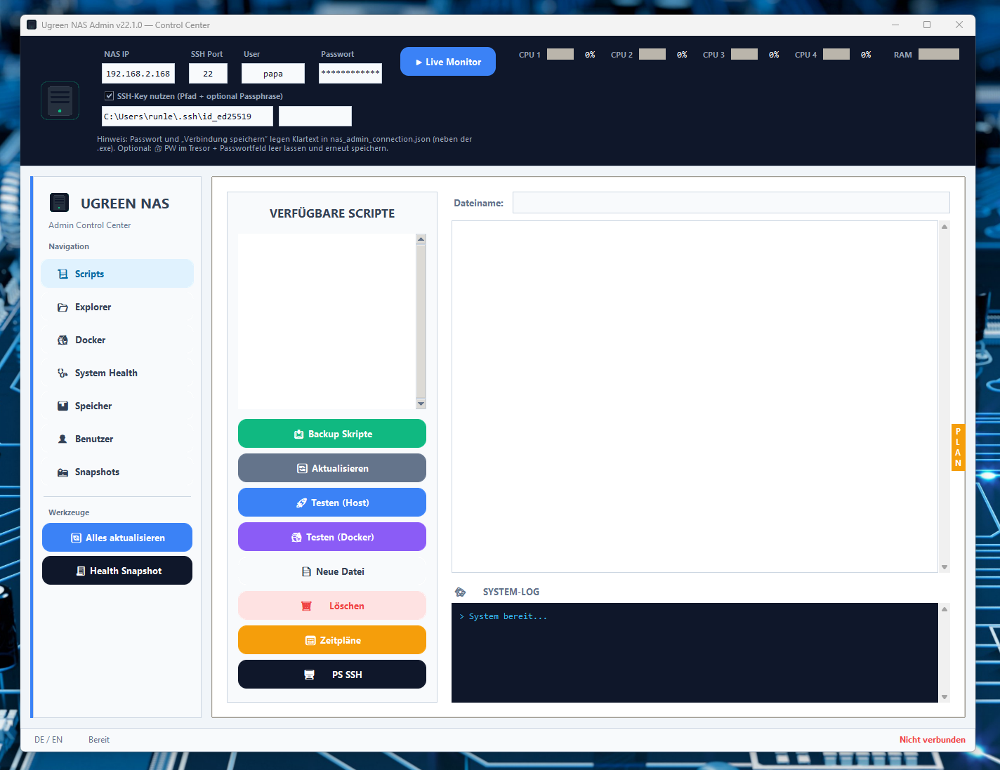
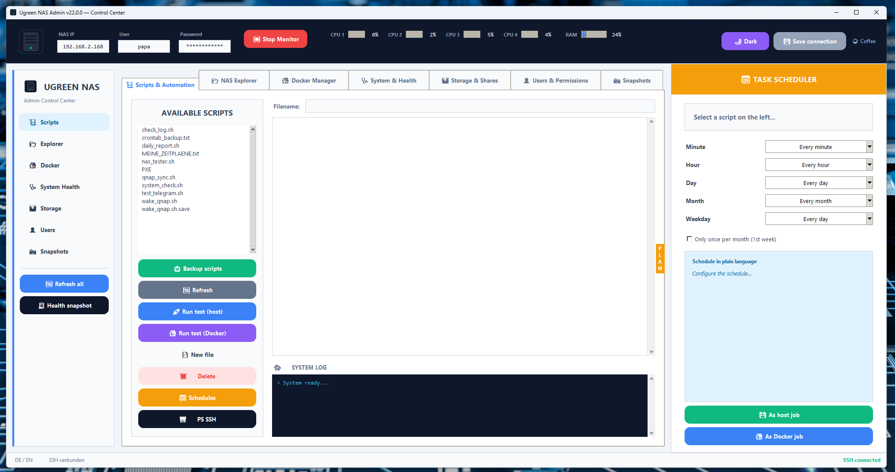
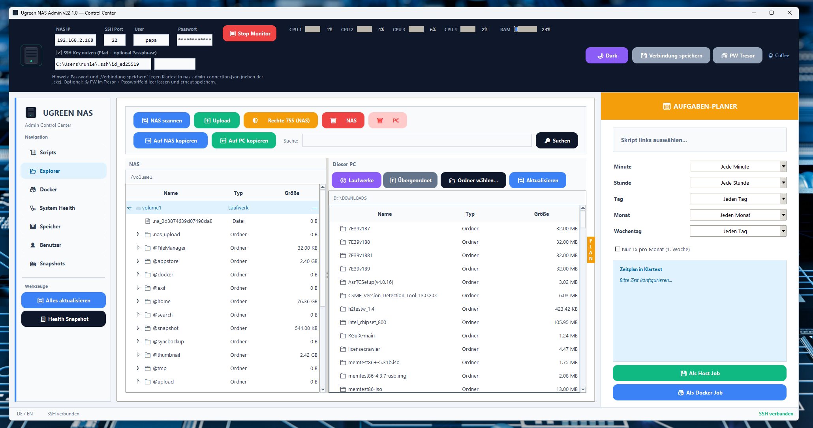
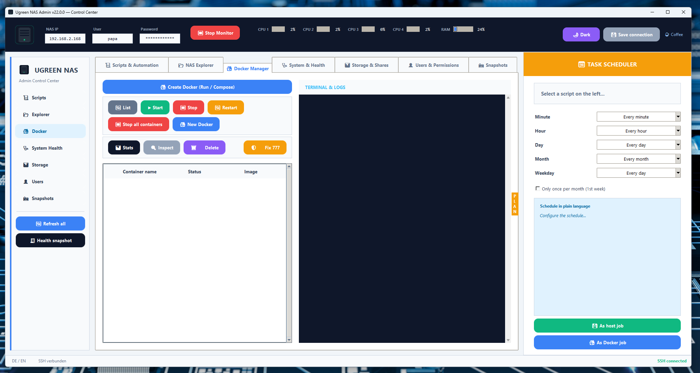
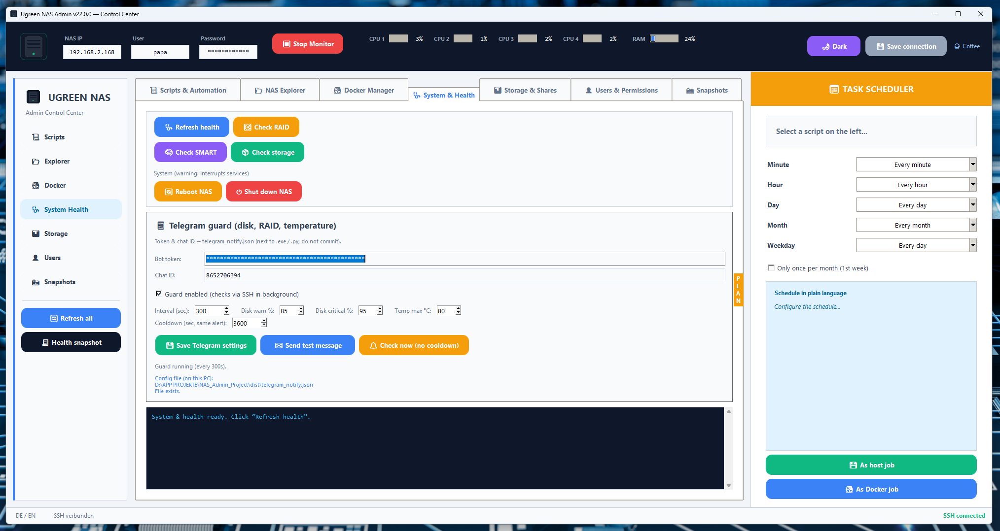
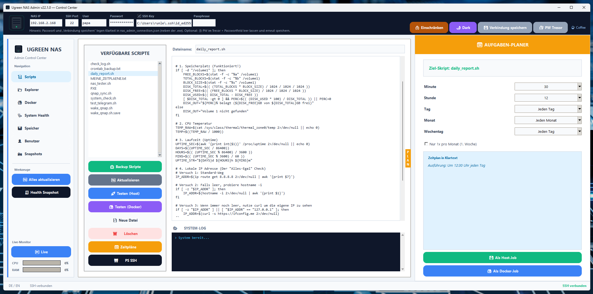

# Öffentliche Release-Quelle — Ugreen NAS Admin

**Eigenes Git-Repository:** Dieser Ordner hat ein **separates** `.git` und wird für **GitHub öffentlich** genutzt. Der übergeordnete Projektordner ist **privat** (ohne Inhalt von `öffentlich/` im Git-Index). Remote setzen: `setup_public_remote.ps1` ausführen oder `git remote add origin …` in `öffentlich/`.

**Release-Links & Ablauf:** Siehe `RELEASE_LINKS.md` in diesem Ordner.

---

## Screenshots / App-Bilder

Diese Bilder liegen unter **`images/`** (z. B. `1.png` … `6.png`) und können auf der **GitHub-Startseite** eingebunden werden, sobald sie committed sind. **Keine echten Passwörter oder privaten IPs** in den Bildern.

<p align="center">
  
</p>
<p align="center"><sub>Überblick / Overview (v22.2+)</sub></p>

<p align="center">
  
  &nbsp;&nbsp;
  
</p>
<p align="center"><sub>Weitere Bereiche · More areas</sub></p>

<p align="center">
  
  &nbsp;&nbsp;
  
</p>
<p align="center">
  
</p>
<p align="center"><sub>z. B. Docker, Explorer, Sidebar mit Live-Monitor · e.g. Docker, Explorer, sidebar with live monitor</sub></p>

---

## Deutsch

### Wichtig

**Dieser Ordner `öffentlich/` ist die feste Quelle für alle öffentlichen Versionen (Release-Builds und Verteilung).**

- **Nicht löschen.** Bei Updates: Inhalt aus dem Hauptprojekt hierher spiegeln (siehe unten), dann bauen oder starten.
- Enthält alle Dateien, die zum **Starten** (`python ugreen_nas_admin.py`) und zum **Bauen der EXE** (`python builder.py` / PyInstaller) nötig sind.

### Verbindung zur NAS (Kopfzeile der App)

Oben im Fenster trägst du die **SSH-Verbindung zum NAS** ein (gilt für alle Tabs, die Befehle per SSH ausführen):

| Feld / Option | Bedeutung |
|---------------|-----------|
| **NAS IP** | Hostname oder IPv4/IPv6 des NAS (wie du auch in PuTTY/Terminal eintragen würdest). |
| **SSH Port** | SSH-Port des NAS — **Standard ist 22**. Wenn dein NAS einen anderen Port nutzt (z. B. 2222), hier eintragen. Wird mit **„Verbindung speichern“** in `nas_admin_connection.json` abgelegt. |
| **User** | Linux-SSH-Benutzer auf dem NAS (z. B. `papa` / `root`, je nach deinem Setup). |
| **Passwort** | Passwort für diesen SSH-User — wird für Login und oft für **`sudo -S`** (Befehle mit Adminrechten) verwendet. **Hinweis Klartext:** siehe Abschnitt *SSH-Passwort im Windows-Tresor* weiter unten. |
| **SSH-Key** (Checkbox) | Wenn aktiv, nutzt die App **Schlüsseldatei + optional Passphrase** (je nach Server auch mit User/Passwort kombinierbar). |
| **Pfad** (unter der Checkbox) | Vollständiger Pfad zur **privaten** Schlüsseldatei auf **deinem PC** (z. B. `C:\Users\…\.ssh\id_ed25519`). Feld hat eine **feste Breite**; längere Pfade kannst du im Feld scrollen. |
| **Passphrase** | Optional: Passphrase des Schlüssels, falls der Key verschlüsselt ist. |

**💾 Verbindung speichern** legt IP, Port, User, Passwort, SSH-Key-Optionen und UI-Sprache in **`nas_admin_connection.json`** neben der EXE bzw. im Startordner ab (Passwort dort im Klartext, sofern du nicht den Tresor nutzt).

**Rechts in der Kopfzeile:** **⚠ Volle Rechte**, **Thema**, **Verbindung speichern**, **🔐 PW Tresor**, **Coffee** — am **unteren Rand** des Kopfbereichs ausgerichtet (inkl. Hinweiszeile darunter).

**Live-Monitor** (CPU gesamt + RAM) sitzt **unten in der linken Sidebar** über der Statuszeile (**DE/EN**). **Sprache** und Verbindungsstatus bleiben in der **Statusleiste** unten.

### Eingeschränkter Modus & „Volle Rechte“ (ab v22.2)

- **Standard:** Viele **gefährliche** Aktionen (Löschen, Uploads, Docker-Eingriffe, Cron im Planer, ACL-Schreiben, Snapshots anlegen/löschen, NAS-Neustart/-shutdown, u. a.) sind **deaktiviert** bzw. ausgegraut.
- **⚠ Volle Rechte** im Header: nach Bestätigung der Warnung werden diese Funktionen **freigeschaltet**. **🔒 Einschränken** kann den sicheren Modus wieder aktivieren.
- Details: **`CHANGELOG.md`** unter Version **22.2.0**.

### Inhalt (Kurz)

| Bestandteil | Zweck |
|-------------|--------|
| `ugreen_nas_admin.py` | Einstieg |
| `ugreen_app/` | App-Logik (Mixins, i18n, UI, …) |
| `nas_ssh.py`, `nas_utils.py` | SSH/Hilfen (Import aus Projektroot) |
| `UgreenNASAdmin.spec` | PyInstaller-Spezifikation |
| `builder.py`, `create_icon.py`, `RUN_BUILDER.bat` | Build |
| `nas_icon.ico`, `nas_icon_app.png` | Icons (falls vorhanden; sonst `create_icon.py` ausführen) |
| `CHANGELOG.md` | Versionshinweise |
| `requirements.txt` | Python-Abhängigkeiten |

### Start (Entwicklung)

```text
cd öffentlich
python -m pip install -r requirements.txt
python ugreen_nas_admin.py
```

### Build (EXE)

```text
cd öffentlich
python builder.py
```

Die EXE liegt danach unter `öffentlich/dist/UgreenNASAdmin.exe` (bzw. `dist/` relativ zu diesem Ordner).

### Abgleich mit dem Hauptprojekt

Wenn du im übergeordneten Ordner `NAS_Admin_Project` entwickelst, musst du **vor einem öffentlichen Release** die geänderten Dateien **nach `öffentlich/` kopieren** (oder Skript/CI nutzen), damit dieser Ordner aktuell bleibt.

**Wichtig für andere, die die EXE selbst bauen:** Dazu gehört auch **`UgreenNASAdmin.spec`** (und bei Änderungen am Build die gleichen Dateien im Hauptordner). Ohne die `.spec` fehlt PyInstaller die feste Spezifikation (Icons, `hiddenimports`, Onefile-Optionen) — dann schlägt der Build fehl oder die EXE startet nicht richtig. Wer nur die fertige **`UgreenNASAdmin.exe`** bekommt, braucht **keine** `.spec` (nur Python-Quellen + Build-Tools zum Nachbauen).

### Lokale Dateien (nicht mitliefern)

Verbindungsdaten und Tokens liegen bei Lauf der App neben der EXE bzw. hier im Ordner als `nas_admin_connection.json` / `telegram_notify.json` — diese gehören **nicht** ins öffentliche Repository (siehe `.gitignore` hier).

### SSH-Passwort im Windows-Tresor (optional, ab v22.1)

Ohne Zusatzpaket bleibt alles wie bisher: **„Verbindung speichern“** schreibt u. a. das Passwort **im Klartext** in `nas_admin_connection.json` (neben der EXE bzw. im Startordner).

**Mit `keyring`** kann das SSH-Passwort stattdessen in der **Windows-Anmeldeinformationsverwaltung** liegen (verschlüsselt vom System verwaltet, keine extra Datei von der App).

1. **Python-Umgebung** (dieselbe, mit der du die App startest oder die EXE baust):

   ```text
   python -m pip install keyring
   ```

   In **PowerShell** zum Projektordner: `cd "…\öffentlich"` bzw. `cd "…\NAS_Admin_Project"` — der Ordner ist für `pip` egal, wichtig ist **dieselbe** `python`-Installation wie bei `python ugreen_nas_admin.py` oder `python builder.py`.

2. App starten bzw. **nach dem Install neu bauen** (`python builder.py` / `RUN_BUILDER.bat`), damit die EXE `keyring` mit einpackt (gleiche Python-Installation wie bei Schritt 1).

3. In der App: **NAS-IP**, **User**, **Passwort** eintragen.

4. **🔐 PW Tresor** klicken — Bestätigung, dass gespeichert wurde.

5. **Optional:** Passwortfeld **leeren**, dann **💾 Verbindung speichern** — die JSON enthält dann kein Klartext-Passwort mehr. Beim **nächsten Start** wird das Passwort aus dem Tresor geladen (nur wenn **IP und User** wie zuvor passen).

**Ohne `keyring`:** Der Button zeigt einen Hinweis; die App funktioniert normal weiter mit Passwort nur in der JSON.

**Hinweis:** Erster `pip install` kann auf „Collecting …“ einige Minuten stehen — das ist meist Netzwerk/PyPI, kein Fehler.

> **Hinweis zu Screenshots:** In einem **öffentlichen** GitHub-Repository sind Bilder immer herunterladbar. Keine echten Passwörter oder private IPs sichtbar machen.

---

## English

### Own Git repository

This folder has a **separate** `.git` and is what you **publish to GitHub** for the public. The parent project folder is **private** (parent Git does not track `öffentlich/`). Set the remote: run `setup_public_remote.ps1` or `git remote add origin …` inside `öffentlich/`.

### Important

**The `öffentlich/` folder is the canonical source for all public releases (builds and distribution).**

- **Do not delete it.** On updates: mirror changed files from the main project into this folder (see below), then run or build.
- It contains everything required to **run** the app (`python ugreen_nas_admin.py`) and to **build the EXE** (`python builder.py` / PyInstaller).

### Connection to the NAS (header bar)

At the top of the window you enter the **SSH connection** used by every tab that runs remote commands:

| Field / option | Meaning |
|----------------|---------|
| **NAS IP** | Hostname or IP of the NAS (same as in PuTTY/Terminal). |
| **SSH port** | SSH port on the NAS — **default 22**. If your NAS uses another port (e.g. 2222), set it here. Saved with **“Save connection”** into `nas_admin_connection.json`. |
| **User** | Linux SSH account on the NAS. |
| **Password** | Password for that user — used for login and often for **`sudo -S`** (privileged commands). **Plain text note:** see *SSH password in the OS vault* below. |
| **Use SSH key** (checkbox) | When enabled, authentication uses your **private key file** (server must accept key auth). |
| **Key path** | Full path to the private key on **your Windows PC** (e.g. `C:\Users\…\.ssh\id_ed25519`). |
| **Key passphrase** | Optional passphrase if the key is encrypted. |

**💾 Save connection** stores IP, port, user, password, SSH-key settings, and UI language in **`nas_admin_connection.json`** next to the EXE (password in plain text unless you use the vault).

**Right side of the header:** **⚠ Full access**, **theme**, **save connection**, **🔐 PW vault**, **Coffee** — aligned to the **bottom** of the full header block (including the hint row below the fields).

**Live monitor** (aggregate **CPU** + **RAM**) is at the **bottom of the left sidebar**, above the status bar (**DE/EN**). **Language** and connection status stay in the **status bar**.

### Restricted mode & “Full access” (v22.2+)

- **By default**, many **risky** actions are **disabled** / grayed out (delete, uploads, Docker changes, planner cron jobs, ACL writes, snapshot create/delete, NAS reboot/shutdown, etc.).
- **⚠ Full access** in the header: after you confirm the warning, those features **unlock**. **🔒 Restrict** can turn safe mode back on.
- Details: **`CHANGELOG.md`** section **22.2.0**.

### Contents (overview)

| Item | Purpose |
|------|---------|
| `ugreen_nas_admin.py` | Entry point |
| `ugreen_app/` | App logic (mixins, i18n, UI, …) |
| `nas_ssh.py`, `nas_utils.py` | SSH helpers (imported from project root layout) |
| `UgreenNASAdmin.spec` | PyInstaller specification |
| `builder.py`, `create_icon.py`, `RUN_BUILDER.bat` | Build tooling |
| `nas_icon.ico`, `nas_icon_app.png` | Icons (if missing, run `create_icon.py`) |
| `CHANGELOG.md` | Release notes |
| `requirements.txt` | Python dependencies |

### Run (development)

```text
cd öffentlich
python -m pip install -r requirements.txt
python ugreen_nas_admin.py
```

### Build (EXE)

```text
cd öffentlich
python builder.py
```

The executable is written to `öffentlich/dist/UgreenNASAdmin.exe` (i.e. `dist/` relative to this folder).

### Sync with the main project

If you develop in the parent folder `NAS_Admin_Project`, **before a public release** copy changed files **into `öffentlich/`** (or use a script/CI) so this tree stays up to date.

**For anyone rebuilding the EXE from source:** include **`UgreenNASAdmin.spec`** (and any other build files you changed in the main tree). Without the `.spec`, PyInstaller lacks the fixed spec (icons, `hiddenimports`, one-file options) — the build may fail or the EXE may not start correctly. Recipients who only get the finished **`UgreenNASAdmin.exe`** do **not** need the `.spec` (only sources + build tools if they rebuild).

### Local files (do not ship)

Connection data and tokens are created next to the EXE at runtime, or in this folder as `nas_admin_connection.json` / `telegram_notify.json` — these must **not** go into a public repository (see `.gitignore` here).

### SSH password in the OS vault (optional, v22.1+)

Without extra packages, **“Save connection”** still stores the password **in plain text** in `nas_admin_connection.json` (next to the EXE or the working folder).

**With `keyring`**, the SSH password can be stored in **Windows Credential Manager** (handled by the OS; the app does not create a separate secrets file).

1. **Python environment** (the same one you use to run the app or build the EXE):

   ```text
   python -m pip install keyring
   ```

   The current directory does not matter; what matters is the **same** `python` you use for `python ugreen_nas_admin.py` or `python builder.py`.

2. Run the app from source, or **rebuild the EXE** (`python builder.py` / `RUN_BUILDER.bat`) after installing `keyring`, using that same Python so PyInstaller bundles it.

3. In the app: fill **NAS IP**, **user**, **password**.

4. Click **🔐 PW vault** — you should get a confirmation when stored.

5. **Optional:** **Clear the password field**, then **💾 Save connection** — the JSON no longer holds the password in plain text. On the **next start**, the password is read from the vault (only if **IP and user** still match).

**Without `keyring`:** the button shows a hint; the app still works with the password only in the JSON.

**Note:** the first `pip install` may sit on “Collecting …” for several minutes — usually network/PyPI, not a hang.

> **Screenshots:** In a **public** GitHub repo, images are always downloadable. Do not show real passwords or private IPs.

## License

This project is licensed under the MIT License. See the `LICENSE` file in this folder for details.
