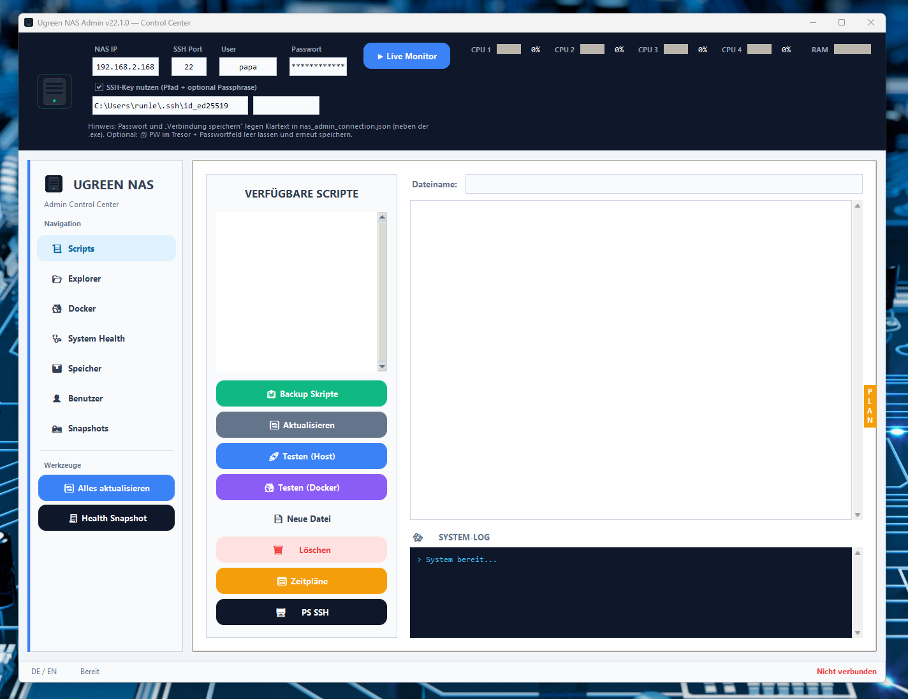
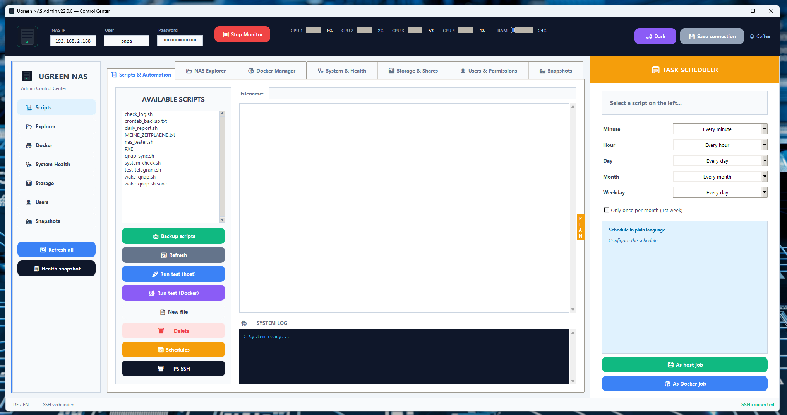
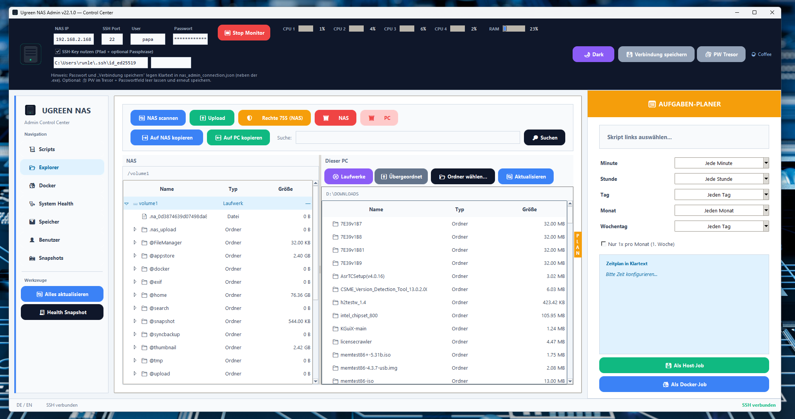
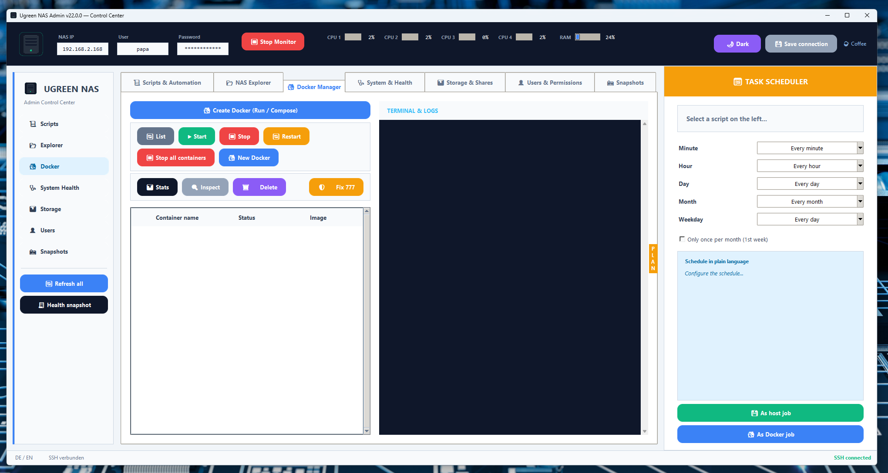
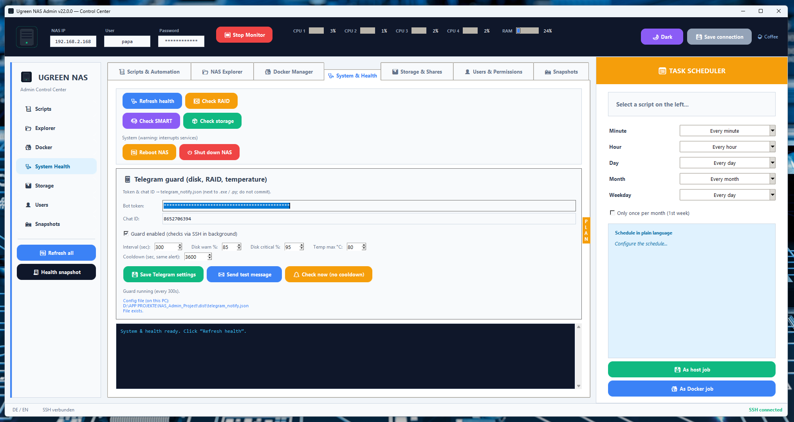
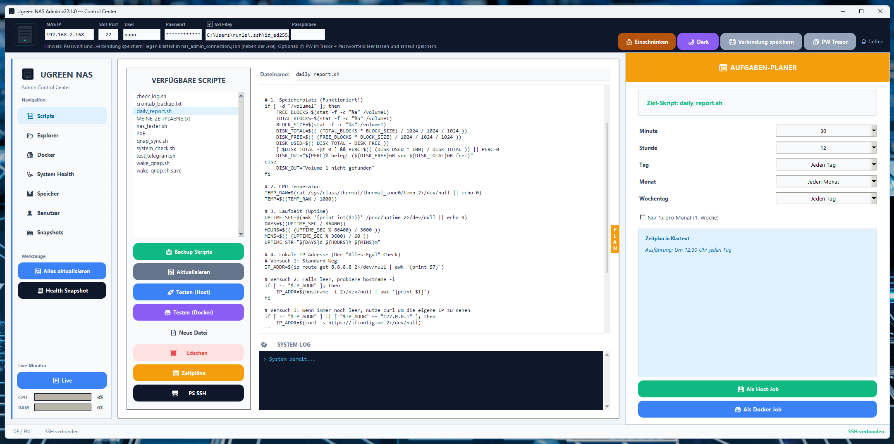
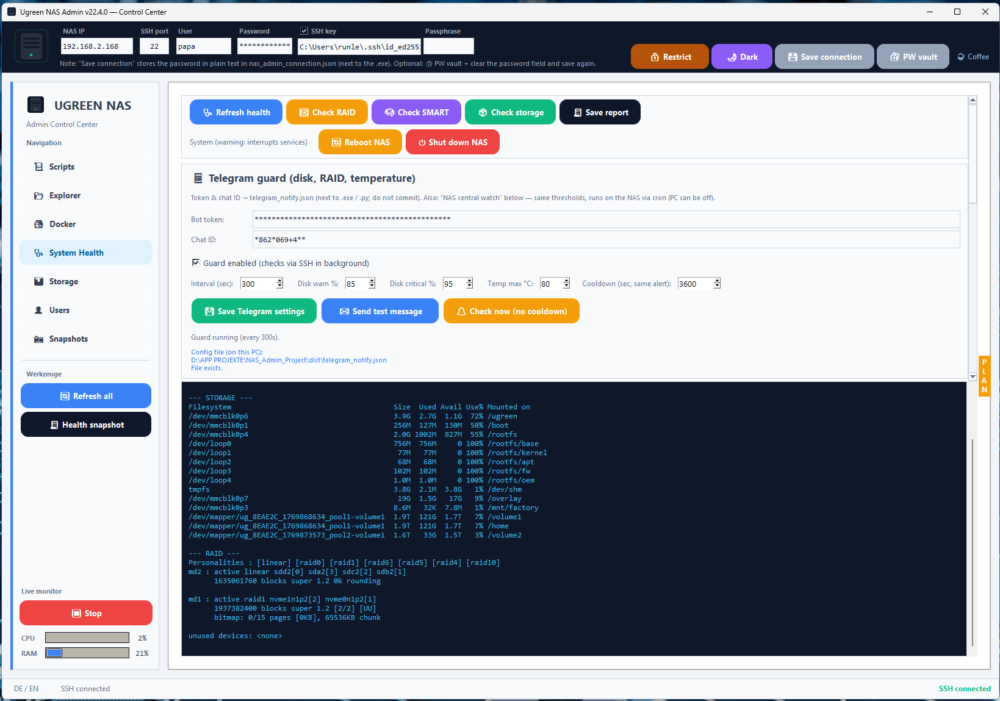
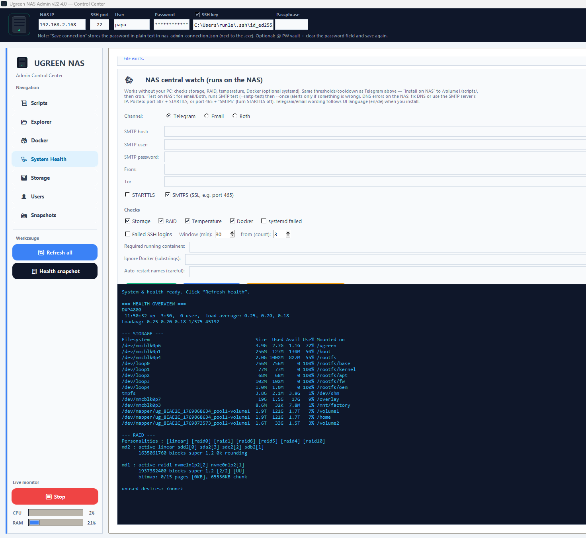
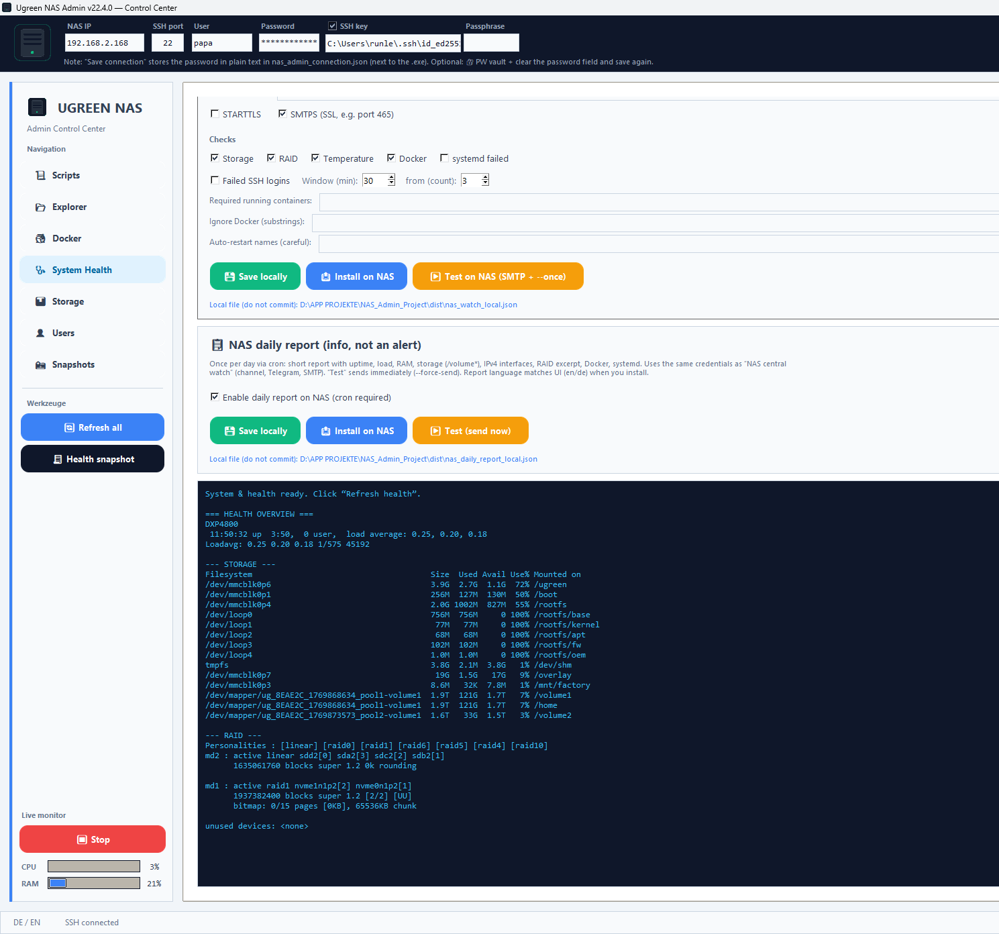

# Ugreen NAS Admin

Desktop **control center** for an **Ugreen (and compatible) NAS** over **SSH**: **Dashboard** with live metrics, **scripts** and cron planner, **Explorer**, **NAS ↔ NAS** SMB copy, **network devices** discovery (as the NAS sees them), **Docker**, **system health** / Telegram guard, **storage**, **ACL**, **snapshots**, **scheduled backups**, and **Settings** — plus optional Telegram/Email notifications. The UI is available in many languages; switch in **Settings** (and often the status bar).

**This file** is the **public release** README (folder **`öffentlich/`**). The step-by-step user guide below matches the **private** project’s main `README.md` (English + German). Release notes: [`CHANGELOG.md`](CHANGELOG.md).

## Download — which button on GitHub?

| What you need | Where to go |
|---------------|-------------|
| **The packaged app (`.exe` / forum ZIPs uploaded to a release)** | **[Releases → Latest](https://github.com/runlevel1977-del/UgreenNASAdmin/releases/latest)** → under **Assets**, pick e.g. `UgreenNASAdmin_v*_…_mit_EXE.zip` (or the no-EXE pack). |
| **SourceForge (mirror / direct file)** | https://sourceforge.net/projects/ugreennasadmin/files/latest/download |
| **Raw source code** of the default branch (for developers) | **Code** → **Download ZIP** on the repo home page. |

**Not something we can “fix” in the repo:** GitHub’s green **Code → Download ZIP** is **always** a **snapshot of the default branch** (`main`). There is **no** repository setting to point that button to **Releases** or to ship the EXE there — that is how **github.com** works.

**What that ZIP is / isn’t:** it is **source code** for developers. It is **not** the same as **Release** assets, and it **does not** contain a **release-built EXE** (build that yourself with `python builder.py` or download from **Releases**). The app version in `ugreen_app/nas_manager.py` (`__version__`) in that zip matches whatever is **pushed to `main`**; if in doubt, open that file in the unzipped tree. For end users, **always** link to **Releases / Assets** (or SourceForge), not the green button.

**Deutsch (kurz):** Wer die **fertige EXE/Release-ZIPs** will: **Releases → Assets** (oder SourceForge) — **nicht** der grüne **Code → Download ZIP**. Dieser liefert **nur Quellcode** des Standard-Branches; eine **Umlenkung** dieses Buttons gibt es bei GitHub **nicht** (kein Repo-Fix). Die **Zahl** in `nas_manager.py` im ZIP-Snapshot entspricht dem letzten **Push** auf `main` (siehe Datei im entpackten Ordner, falls unsicher).

**Links (immer aktuell):** [GitHub **Latest release**](https://github.com/runlevel1977-del/UgreenNASAdmin/releases/latest) · SourceForge „latest“ (oben) · [All releases](https://github.com/runlevel1977-del/UgreenNASAdmin/releases)

### What's new in v23.5.0

- **Network devices tab:** list **LAN and USB devices the NAS sees** (ARP/neighbor-style data, `lsusb` / `lsblk` for USB); **Scan devices** requires an active **SSH** session.
- **Translations:** full **devices** tab strings and extended **Telegram / SSH-login hint** (why security messages differ from disk thresholds, **keepalive**, UGOS tips) for **nine** UI languages (hr, fr, es, it, pl, ru, tr, ko, zh) via `ugreen_app/i18n_supplement_devices_telegram.py`.
- **`translate()`:** small **LRU cache** for plain string lookups (fewer repeated lookups when the UI redraws).
- **Docs:** README user guide — full **tab order** (Dashboard, Network devices, Backup), Telegram/SSH clarification (EN + DE).

**Earlier highlights (v23.3):** **Webcam recorder suite**, **disk imaging & restore**, **Docker Catalog** — see [`CHANGELOG.md`](CHANGELOG.md).

**Walkthrough on YouTube:** [https://youtu.be/RDaEZhuEbCc](https://youtu.be/RDaEZhuEbCc)

### Screenshots

Images live under **`images/`** (`1.png` … `6.png`, health tab). **Do not** show real passwords or private IPs in screenshots.

<p align="center">
  
</p>
<p align="center"><sub>Main window (v23+ UI; screenshot may vary by build)</sub></p>

<p align="center">
  
  &nbsp;&nbsp;
  
</p>
<p align="center"><sub>More areas</sub></p>

<p align="center">
  
  &nbsp;&nbsp;
  
</p>
<p align="center">
  
</p>
<p align="center"><sub>e.g. Docker, Explorer, sidebar with live monitor</sub></p>

<p align="center">
  
  &nbsp;&nbsp;
  
</p>
<p align="center">
  
</p>
<p align="center"><sub>System &amp; Health tab (Telegram, NAS central watch, daily report)</sub></p>

### About this public folder

This folder **`öffentlich/`** is the **canonical public release tree** for GitHub (separate `.git` when published). The parent project **`NAS_Admin_Project`** (private) may not include this copy. Set the remote with **`setup_public_remote.ps1`** or `git remote add origin …` here. **Do not delete** it — it contains what you need to **run** the app and **build** the EXE.

---

## User guide (English) — step by step

The **sidebar** matches the main areas (top to bottom). Use it to switch **tabs** in the main panel. A few features live **outside** a tab: the **header** (connection, “Full access”, dark/light, Info, support link), the **planner** strip on the right, and the **bottom status bar** (language, status, connection).

**Safety:** Many actions need **“Full access”** (or similar) in the header; without it, destructive/SSH features stay locked. Re‑enable restrictions when you are done with maintenance.

**Tab order (main area, left to right)** — use the **sidebar** icons to jump directly:

1. **Dashboard** — overview and live tiles (CPU/RAM, disks, network, Docker summaries, upcoming jobs).  
2. **Scripts** — edit and run shell scripts, planner/cron.  
3. **Explorer** — NAS ↔ PC file browser and transfers.  
4. **NAS ↔ NAS** — copy between this NAS (SSH) and a second system (SMB).  
5. **Network devices** — list **LAN and USB devices the NAS sees** (requires SSH; see below).  
6. **Docker** — containers, logs, compose, catalog/wizard.  
7. **System health** — load, RAID/SMART/storage checks, Telegram/email guard, NAS central watch, reboot/shutdown (guarded).  
8. **Storage** — volumes, shares, top folders, disk imaging/restore (dangerous).  
9. **Users (ACL)** — inspect path permissions, chmod/chown helpers.  
10. **Snapshots** — btrfs/ZFS/Snapper where available.  
11. **Backup** — package Docker scripts, user data, or exports to archives (see below).  
12. **Settings** — connection profiles, language, paths, Telegram/SMTP, script notifications, SMB peers.

### Dashboard

**Purpose:** At-a-glance **live** metrics while this tab is open: CPU/RAM sparklines, key **volume/disk** usage (`df`), **network** throughput per interface, and a compact **Docker** summary (running containers). Lower sections summarize **cron jobs** the app manages (host/Docker/script schedules and backup-related entries when installed).  

- **SSH must be connected** for live numbers; otherwise tiles show the “SSH needed” hint.  
- Switching away stops live updates tied to this page (design goal: reduce background load).  
- Use it to spot **_disk fill_, busy CPU/RAM**, or **Docker downtime** before opening deeper tabs.

### 1) Scripts

**Purpose:** Manage shell scripts on the NAS (usually under `/volume1/scripts/`), run tests, and schedule jobs.

- **Left:** List of script files. Select one to load it into the editor. Scripts with an active **notification rule** (see Settings) may show a **bell** icon in the list.
- **Right:** **Filename** and **template** buttons (e.g. rsync/restic/rclone) to pre-fill the editor, **log** area, and **Save** to write the file to the NAS.
- **Bottom buttons (left column):**  
  - **Backup / export scripts** to your PC.  
  - **Refresh** the list.  
  - **Test on host** — runs the script in a normal shell context.  
  - **Test in Docker** — runs the script in a Docker-oriented test path (as implemented by the app).  
  - **New / clear** to start a fresh buffer.  
  - **Delete** a remote script.  
  - **Schedules** — open the NAS **cron** list/editor (advanced).  
  - **Open PowerShell** (local helper on Windows) when useful for your workflow.
- **System log** (bottom of the app): shows what the app is doing; use it for troubleshooting.

**Planner (the orange vertical strip on the right edge of the main area):**  
Opens a **drawer** for **Cron scheduling**.

1. In **Scripts**, select a script in the list (the drawer shows the chosen target).  
2. Set **Minute / Hour / Day / Month / Weekday** (values follow your UI language’s cron labels).  
3. Read the **human-readable** summary.  
4. **Add host job** = standard cron on the NAS for that script, or **Add Docker job** = cron entry tailored to the app’s Docker script workflow.  
5. **Full access** may be required to install cron lines.

**Why this matters:** Scheduled scripts can run at night; combine with **script notifications** in Settings so you get **Telegram/Email** on success or failure even when the PC is off (NAS-side runner; see Settings → sync runner).

### 2) Explorer

**Purpose:** Browse the NAS and your **local PC**, upload/download files, and copy paths.

- **Two panes:** NAS and **“This PC”** (or similar). Navigate folders, use **search** where available, and open the **context menu** for upload, delete, permissions helpers, and **load into script editor** for quick editing.
- **UGREEN** panel: quick context for the active NAS (branding/labels as in the app).
- **Transfers** may show progress, unpack steps, and ETA on large jobs.

**Typical flow:** pick a folder on the NAS, upload from PC (or the reverse), or open a file’s path to reuse in a script or Docker path field.

### 3) NAS ↔ NAS

**Purpose:** Use the **Ugreen** side over **SSH** (this app) and a **second** NAS (or file server) over **SMB** in one view — copy between sides.

- **Settings** must define at least one **second NAS** profile: host/label, **SMB** user/password (Windows maps the share). You can keep **multiple peer profiles** and select the **active** one in Settings.
- **Connect / browse** the peer, then use the same patterns as the Explorer: copy paths, start transfers, and **disconnect** when you leave the tab (the app tries to unmount **Windows** drive mappings when you switch away from this tab).

**Tip:** Fix SMB credentials, DNS, and “guest vs user” on the other device before expecting stable transfers.

### 4) Network devices

**Purpose:** See **devices from the NAS’s point of view** over SSH — useful when you plug in **USB** sticks/disks or want a quick **LAN neighbor / ARP** picture without scanning from the PC.

- **Requirements:** Active **SSH session** to the NAS (same connection as elsewhere). Without SSH, **Scan devices** explains that you must connect first.  
- **Scan devices** runs remote commands on the NAS (e.g. neighbor/ARP-style data for **LAN** rows; **lsusb** / **lsblk** for **USB** — hubs/controllers are filtered so you mostly see real endpoints and storage where `TRAN=usb`).  
- The table columns (**Kind, Name/ID, IPv4, Details**) are translated with the rest of the UI.  
- If the list is empty, the NAS reported no matching entries for that scan (permissions, firmware, or no devices).

**Not a PC network scanner:** This tab does **not** replace Windows “see all Wi‑Fi clients”; it reflects **what the NAS kernel reports** via SSH.

### 5) Docker

**Purpose:** List containers, start/stop/restart, read logs, inspect, clean up, and work with **Compose** paths; optional **catalog** to pull images and launch a **wizard** for `docker run` or compose.

- **Create / new container** — opens a guided flow (name, image, ports, volumes, and more depending on your build).
- **List / refresh** the container list; select a row to load **logs** in the right-hand panel.
- **Start / stop / restart / stop all** — operational controls (require **Full access** where marked).
- **Stats / inspect** — diagnostics for the selected container.
- **Delete** a container, **fix permissions (777/777 path helpers)** as offered — use with care.
- **Docker Catalog** — search **Docker Hub**, pick an image, and pre-fill a deployment template.
- **Compose file path** + **config / ps / up -d** — run `docker compose` (or the composed equivalent) for the file on the NAS. Fill the path in Settings defaults if you always use the same file.

- **Log panel:** read static logs, or **live tail** (stream) and **stop** live tail when you are done.

### 6) System Health

**Purpose:** See host load, storage, RAIDs, and optional **Telegram / Email** notifications for threshold alerts. Also hosts **reboot / shutdown** (guarded) and a **Save report** snapshot of what the panel collected.

- **Refresh / RAID / SMART / storage** buttons — re-query the NAS. Results stream into the **log** area.  
- **Save report** — exports a text snapshot to your PC (path chosen by the app’s dialog as implemented).  
- **Reboot / shutdown** — only when **Full access** is enabled; use only if you know the NAS is not busy with critical I/O.

#### 6a) NAS ↔ Telegram: thresholds (panel in System Health)

This block sends **alerts** when free space, temperature, or related checks cross **warning/critical** levels (exact metrics depend on what the connected NAS exposes).

- **Enable watch** / interval between checks, **disk warn/crit %**, **max temperature**, **cooldown** (to avoid message spam).  
- **Test Telegram** and **Run checks** — verify the bot and the remote script path.  
- Status labels may show where the app expects the helper script (under `/volume1/scripts/` or as configured) — follow on-screen text after you **Save** in Settings (Telegram/Email must be working first).

**Always configure Telegram/Email in Settings first (bot token, chat id, etc.), then return here to tune thresholds and test.**

**Understanding “SSH login” alerts vs. disk guard:** The **gray help text** under the Telegram block explains: messages about **SSH logins** usually come from the **NAS security audit** (each new SSH session), **not** from the disk/temperature thresholds in this panel. This app uses **SSH keepalive** so sessions drop less often (fewer reconnects = fewer login events). On **UGOS**, you can often mark your **PC’s IP as trusted** or reduce that notification type in the NAS UI — see the in-app hint in your language.

#### 6b) NAS “central watch” / deploy helpers (in System Health, below Telegram)

**Purpose:** Deploy and maintain a **NAS-side watcher** (systemd/cron) that reuses the same **Telegram/Email** credentials. Options often include which **containers** must be running, **ignore** lists, **auto-restart** lists, and whether **Docker** state is part of the check.

- Use **“Install on NAS” / “Test on NAS”** style buttons (exact labels in your language) to upload scripts, run a test, and set **cron**/**systemd** as the wizard describes.  
- The built-in help text in the app explains **ports** and **Posteo/STARTTLS** examples for **SMTP** in some versions — read that panel for email specifics.

#### 6c) Daily report (if shown)

Some builds add a **daily report** block that can email/cross-post health summaries. Configure **SMTP/ Telegram** in Settings; follow the in-app description for schedule and “run once” tests.

**Bottom of tab:** a large **scrolling** health log view; keep it in mind when pasting to support (copy relevant lines).

#### Telegram — detailed: create a bot and connect the app

You need: a **Telegram** account, one **bot token**, and your **chat id** (or group id) the bot is allowed to message.

1. **Install Telegram** (phone or desktop) and sign in.  
2. **Open a chat** with **@BotFather** (official bot from Telegram; verify the blue check / official link).  
3. Send **`/start`**, then **`/newbot`**.  
4. **Bot name** — a display title users see (can contain spaces, e.g. `My NAS Watcher`).  
5. **Username** — must end with `bot` and be globally unique (e.g. `ugreen_myhome_bot`).  
6. **BotFather** answers with a **token** (long string, looks like `123456789:AAHq…`). **Save it in a password manager** — anyone with the token can control your bot.  
7. **Start your bot** — tap the **link** from BotFather (`t.me/Yourbot…`) and press **Start**. Private chats: this step is **required** before the API returns messages.  
8. **Get your `chat_id`:**  
   - Send any message to your new bot.  
   - In a **browser**, open:  
     `https://api.telegram.org/bot<YOUR_TOKEN>/getUpdates`  
     (replace `<YOUR_TOKEN>` with the full token, no spaces).  
   - In the **JSON** response, find `"chat":{"id": …}` — the number is the **chat id** (for groups, ids are often **negative**; for private chats, a positive id). **Groups:** add the bot to the group, send a **mention** or `/start`, then `getUpdates` again to read the group’s id.  
9. In **Ugreen NAS Admin → Settings**, paste **bot token** and **chat id** into the **Telegram** fields. Use **Show/Hide** if your build masks secrets. **Save to disk** and **Apply to current UI** as the buttons say.  
10. In **System Health**, use **Test Telegram** / run checks. You should get a test message. If not: re-check **token**, **chat id**, whether you pressed **Start** in the private chat, and whether **DNS/firewall** blocks `api.telegram.org` on the PC or the NAS (for server-side tools).

**Script notifications and NAS-side runners** in Settings re-use the **same** bot credentials. After changing token/chat id, **re-save** and use **“Sync / install runner on NAS”** (wording in your app) if you rely on **cron** jobs without a PC.

### 7) Storage (Speicher / Storage)

**Purpose:** Volumes, shares, and **space** insights; also **raw disk image** work (imaging to PC, imaging to the NAS, **restore** from PC/NAS) with strong confirmations (dangerous for data).

- **Refresh volumes / refresh shares** — lists `df` / SMB (as implemented).  
- **Top path** (e.g. `/volume1`) + **Top 20** folders by size.  
- **Disk device** list — **scan** devices, then **image to PC** or **image to NAS** for full-disk / partition backups.  
- **Path for image** on the NAS, **restore** from **PC** or from **NVS path** (exact wording on buttons) — read every confirmation dialog.  
- Output in the **scrolling** text area: copy to bug reports with care (may contain paths).

**Warning:** **Restore** and **overwrite** operations can **destroy** data. Keep **Full access** and backups in mind.

### 8) Users (ACL) / “Benutzer”

**Purpose:** Inspect a **path** on the NAS (permissions/ownership) and run **limited chmod/chown** helpers, plus list system **users and groups** for reference.

- Enter a **path** (default `/volume1`). **Show** metadata.  
- **Apply chmod** (755, 777 recursive, or custom mode) and **chown** (`user:group`) — all **dangerous** on a live system.  
- **List users / list groups** — read-only over SSH.

**Best practice:** Test on a **non-production** subfolder. Avoid **777** except when you understand the security impact.

### 9) Snapshots

**Purpose:** **Detect** which snapshot backends (btrfs / ZFS / Snapper) the NAS uses, then **list / create / delete** snapshots as supported.

- **Detect backend**, then the matching **list** action.  
- **Base path** (e.g. a subvolume or dataset root). **Create** / **delete** per backend — **deleting** snapshots is irreversible; confirm prompts carefully.

**Note:** Not all firmware exposes every backend; what you see in the list is what the NAS reports on SSH.

### 10) Backup

**Purpose:** Create **archives on the NAS** (or related flows) for **Docker compose/scripts**, **per-user data**, or **broader “user data” exports** — depending on what your build exposes. Typical steps:

- Choose **volume scope** (all volumes vs. single volume) and refresh lists from the NAS (**Refresh lists** / similar).  
- Pick a **user** or `*` for all users (hover/helper text explains scope).  
- Use the action buttons (e.g. **Docker/scripts backup**, **user data**) — these run over SSH and may take time on large homes.  
- After scheduling backups from this tab or the planner, related jobs can appear on the **Dashboard** job summary when a cron entry exists.

**Safety:** Like other storage operations, **read every confirmation**; **Full access** may be required. Keep free space and paths in mind.

### 11) Settings

**Purpose:** Central configuration for the **app on your PC** (and optional files pushed to the **NAS**).

- **Load / apply / save** — read JSON from disk, apply values to the current session, and persist to your **per-user** app data directory. Many builds store **sensitive** values only locally (never commit these files to git).  
- **Connection profiles** — multiple **IP / port / user / password** sets; optional **SSH key** and **keyring** (OS vault) for passwords on Windows. **Save connection** may write **plain text** password next to the executable unless you use the **vault** option — read the in-app **security** hint.  
- **UI language** — pick a language, then **apply**; the UI may rebuild.  
- **Default paths** — scripts directory, default **Docker compose** path, **Explorer root** (as used in other tabs).  
- **Telegram** — `bot token`, `chat id` (from the bot chapter above).  
- **Email (SMTP)** — host, port, user, password, from/to, **STARTTLS** / **SMTPS**; used by script notifications, daily reports, and some NAS watch flows. The app’s inline hints (e.g. **Posteo** on port 587) help with providers. **Test** buttons, when present, send a trial email.  
- **Script notification rules** — per **script** name, **Telegram or Email** channel, and **on success / on failure / both**; a **list** of rules; **add/delete**; **Sync runner to NAS** so **cron** jobs can notify without a PC.  
- **Second NAS (SMB) peers** — multiple **profiles** (host, user, pass, label) for **NAS ↔ NAS**; mark one as **active** where the UI offers it.  
- **Status / help text** in Settings may show **“needs attention”** (e.g. missing Telegram) — follow the label.

**Where files go:** e.g. `app_settings.json`, `nas_admin_connection.json` next to the app or in your app data path — the exact place is build-dependent; the Info button’s README/CHANGELOG also explains paths when shipped.

### Side tools (sidebar & status bar)

- **Refresh all panels** — re-fetch scripts, Docker, health, and storage in one go (may be slow on large systems).  
- **Health snapshot** — save a text snapshot (same as the quick action in some tabs).  
- **Webcam** (if present) — opens a **recorder** window for a USB webcam or similar (preview, **FPS**, path on NAS, optional **scheduling** / **self-test**; depends on build). **Full access** may be required.  
- **Live monitor** — a compact **stream** of NAS metrics; **Start/Stop** near the **sidebar** (wording: “Live Monitor” or translated).  
- **Status line** — connection state; **not connected** in red if SSH is down.  
- **Language** control at the very bottom to cycle or switch (depending on your build, Settings may be the main place).

### Header bar

- **Full access** — unlocks dangerous features until you **restrict** again.  
- **Light / dark** theme.  
- **Info** — README, CHANGELOG, about text, support link, and contact email.  
- **Header connection fields** (if not moved to Settings in your build) — some releases keep **IP / user / connect** in the header; others centralize them under **Settings**.

### Demo and more

- **YouTube (demo, may vary by version):** https://youtu.be/RDaEZhuEbCc  
- **Changelog (this folder):** [`CHANGELOG.md`](CHANGELOG.md)  

**Run from source (in this `öffentlich` folder):**

```text
cd öffentlich
python -m pip install -r requirements.txt
python ugreen_nas_admin.py
```

---

## Anleitung (Deutsch) — Schritt für Schritt

**Sicherheit:** Viele Aktionen erfordern oben **„Volle Rechte“**. Ohne Freigabe bleiben gefährliche Schritte deaktiviert. Nach Wartung wieder **einschränken**.

**Reihenfolge der Tabs (Hauptbereich)** — in der **Seitenleiste** dieselbe Reihenfolge per Icon erreichbar:

1. **Dashboard** — Überblick, Live-Kacheln (CPU/RAM, Plattenbelegung, Netz je Schnittstelle, Docker-Kurzinfo, geplante Jobs).  
2. **Scripts** — Skripte, Editor, Cron/Zeitplaner.  
3. **Explorer** — NAS ↔ PC, Übertragungen.  
4. **NAS ↔ NAS** — Ugreen per SSH plus zweites System per SMB.  
5. **Netzwerkgeräte** — Geräte, die der **NAS über SSH** sieht (LAN/USB; siehe eigener Abschnitt).  
6. **Docker** — Container, Logs, Compose, Katalog/Assistent.  
7. **System Health** — Last, RAID/SMART/Speicher, Telegram/E-Mail-Wächter, Deploy-Helfer.  
8. **Speicher** — Volumes, Freigaben, Platz-Top, Imaging/Wiederherstellung.  
9. **Benutzer (ACL)** — Rechte/ chmod-chown-Helfer.  
10. **Snapshots** — btrfs/ZFS/Snapper je nach System.  
11. **Backup** — Docker/Skripte, Nutzerdaten, Archive (Cron-Anbindung möglich).  
12. **Settings** — Verbindung, Sprache, Pfade, Telegram/SMTP, Benachrichtigungen, SMB-Peers.

Darunter in der Sidebar: **Hilfswerkzeuge** (z. B. alles neu laden) sowie (je nach Version) **Webcam** und **Live Monitor**.

### Dashboard

**Ziel:** **Live-Metriken**, solange dieser Tab aktiv ist: CPU/RAM-Verläufe, **df**-/Volume-Zeilen, **Netz**-Durchsatz, **Docker** (laufende Container), plus eine Übersicht **geplanter Cron-Jobs**, die die App kennt.

- Ohne **SSH-Verbindung** zeigen die Kacheln den Hinweis, dass SSH nötig ist.  
- Beim Tab-Wechsel laufen keine dauerhaften Hintergrund-Abfragen für dieses Dashboard weiter (weniger Last).  
- Geeignet, um **vollen Speicher**, hohe Last oder **Docker-Probleme** schnell zu erkennen, bevor du tiefer einsteigst.

### 1) Scripts

**Ziel:** Skripte auf dem NAS (typisch `/volume1/scripts/`) bearbeiten, testen und per **Cron** planen.

- **Links:** Dateiliste. Auswahl lädt in den **Editor**. Skripte mit **Benachrichtigungsregel** können mit **Glocke** markiert sein (siehe **Settings**).  
- **Rechts:** **Dateiname**, **Vorlagen-Buttons** (z. B. rsync/restic/rclone), **Protokoll**, **Speichern** schreibt auf den NAS.  
- **Knopfleiste links unten:** u. a. **Skripte sichern/Backup**, **Liste neu laden**, **Test auf dem Host**, **Test in Docker**, **Neu / leeren**, **Löschen**, **Schedules (Cron)**, ggf. **PowerShell** unter Windows.  
- **System-Log** (unten): für Fehlersuche.

**Planer (orangefarbener Streifen rechts am Hauptfenster):** Klappt den **Cron-Planer** auf.

1. In **Scripts** ein Skript wählen.  
2. **Minute, Stunde, Tag, Monat, Wochentag** setzen.  
3. **Klartext-Zusammenfassung** lesen.  
4. **Host-Job** = normaler **cron** auf dem NAS, **Docker-Job** = Eintrag für den Docker-Workflow der App.  
5. Ggf. **volle Rechte** zum Schreiben der Cron-Tabellen.

Kombinieren mit **Benachrichtigungen** in **Settings**, damit Nacht-Jobs per **Telegram/E-Mail** melden, wenn der PC aus ist (NAS-Runner muss **synchronisiert** sein).

### 2) Explorer

**Ziel:** NAS und **lokalen PC** durchsuchen, **hoch- und herunterladen**, Pfade kopieren, Kontextmenü nutzen.

- Zwei **Bereiche** (NAS / Dieser PC), **Suche** wo verfügbar, **Kontextmenü** (u. a. in Editor laden, Löschen, Rechte, Upload). **UGREEN**-Panel: Kontext für den aktuellen Speicher.  
- Große Kopiervorgänge zeigen ggf. **Fortschritt / ETA** an (je nach Ablage).

**Typisch:** Zielordner wählen, Datei ziehen oder per Dialog **hochladen** / **herunterladen**.

### 3) NAS ↔ NAS

**Ziel:** Am **Ugreen** per **SSH** (diese App) arbeiten und **parallel** ein zweites System per **SMB** (Windows-Freigabe) ansprechen, um Daten hin- und herzuschieben.

- In **Settings** mindestens ein **Zweit-NAS-Profil** hinterlegen (Host, Benutzer, Passwort, **Anzeigename**). **Mehrere Profile** wechseln, ein Profil **aktiv** wählen.  
- Vom Tab aus **Peer verbinden / durchsuchen**; beim **Tab-Wechsel** versucht die App, **Windows-Laufwerksmappings** ordentlich zu trennen.

**Tipp:** SMB-Zugang, **DNS-Name** vs. **IP** und Rechte am zweiten System zuerst prüfen.

### 4) Netzwerkgeräte

**Ziel:** Liste der **Geräte aus Sicht des NAS** (per SSH auf dem Gerät ermittelt) — praktisch für **USB**-Sticks/Festplatten und einen schnellen **LAN-/Nachbarschafts**- Überblick, ohne den PC zu scannen.

- **SSH muss verbunden sein** — sonst weist **„Geräte suchen“** darauf hin.  
- **Geräte suchen** führt Kommandos auf dem NAS aus (Nachbarschaft/ARP-artige Daten für **LAN**; **lsusb** / **lsblk** für **USB**; Controller/Hubs werden gefiltert, sichtbar sind vor allem echte Endgeräte und Speicher bei `TRAN=usb`).  
- Spalten **Art, Name/Kennung, IPv4, Details** folgen der gewählten **UI-Sprache**.  
- Leere Liste = das NAS hat für diesen Scan nichts Passendes geliefert (oder keine passenden Geräte).

**Kein PC-Netzwerkscanner:** Hier siehst du nur, **was das NAS über SSH meldet**, nicht automatisch jedes WLAN-Client-Gerät in deinem Heimnetz.

### 5) Docker

**Ziel:** Container sehen, steuern, **Logs/Inspect**, **Compose**-Pfad bedienen, optional **Katalog** (Docker Hub) und **Assistenten** für `docker run` / Compose.

- **Erstellen / Neu** startet den **Wizard** (Bild, Ports, Volumes, …).  
- **Liste aktualisieren**, Zeile wählen → **Logs** rechts. **Start/Stop/Neustart/Alle stoppen** — Achtung, **löscht** bzw. stoppt wirklich. **Statistik / Inspektieren** für Diagnose. **Rechte**-Helfer (777 o. Ä.) **nur** mit Verständnis nutzen.  
- **Docker-Katalog** — Image suchen, Vorlage füllen.  
- **Compose-Datei** + **config / ps / up -d** — Pfad z. B. `/volume1/docker/docker-compose.yml` in **Settings** hinterlegen, wenn es immer derselbe ist.  
- **Log:** **Live-Stream** an/aus, damit fließend Log nicht unnötig läuft.

### 6) System Health

**Ziel:** Last, **Speicher**, **RAID**, ggf. **SMART/Storage**-Infos; **Meldungen** per **Telegram/E-Mail** bei Grenzwerten; ggf. **Neustart / Herunterfahren** (nur mit **volle Rechte**). **Report speichern** = Text-Snapshot des Panels.

- **Aktualisieren / RAID / SMART / Speicher** — Ruft Befehle per SSH; Ausgabe im **Bereich unten** im Tab. **Report** auf die PC-Platte sichern, wenn Ihr so einen Knopf habt.  
- **Reboot/Shutdown** nur mit bewusster Wartung.

#### 6a) Telegram-Überwachung (Grenzen im Tab System Health)

**Häkchen**, **Intervall**, **Platten-warn/crit-%-Werte**, **max. Temperatur**, **Abklingzeit (Cooldown)**, damit nicht **zu viele** Nachrichten kommen. **Test** und **Checks ausführen** — Voraussetzung: **Token und Chat-ID** in **Settings** und Bot gestartet (s. unten *Telegram ausführlich*).  
Hinweistexte im Tab zeigen oft den **erwarteten Skriptpfad** auf dem NAS (z. B. unter `/volume1/scripts/`).

**Hintergrund »SSH-Anmeldung« vs. Platten-Wächter:** Der graue **Erläuterungstext** unter dem Telegram-Block (in allen unterstützten Sprachen) erklärt: Meldungen zu **SSH-Anmeldungen** kommen oft aus dem **UGOS-/Sicherheitsaudit** des NAS (jede neue Sitzung), **nicht** von den Platten-/Temperatur-Schwellen in diesem Panel. Die App nutzt **SSH-Keepalive**, damit Sitzungen seltener abreißen (**weniger** neue Anmeldevorgänge). Auf dem NAS kannst du ggf. die **fest IP deines PCs als vertrauenswürdig** eintragen oder dort die Benachrichtigungsart drosseln — siehe Text in der App.

#### 6b) Zentraler NAS-Wächter (Deploy)

**Ebenfalls in System Health:** Skripte auf dem NAS ablegen, **systemd/cron** einrichten, **Docker-Container-Überwachung** (Listen für „muss laufen“ / **Ignorieren** / **auto-restart**), Kanal **Telegram/E-Mail/Beides** — alles an dieselben **Zugangsdaten** aus **Settings** geknüpft. **Auf dem NAS testen** / **Installieren** führt durch die Ablage `…/scripts/` und ggf. **Cron-Test** / `--once`.

#### 6c) Tagesbericht (falls sichtbar)

E-Mail- oder **kombinierter** Ablauf mit denselben **SMTP**-Einstellungen.

**Tipp für Support:** Wenn etwas hakt, **Log-Ausgabe** aus System Health, **Fehlermeldung** und ggf. **Screenshot** mitschicken.

#### Telegram (ausführlich): Bot anlegen und in der App eintragen

1. **Telegram** (Handy oder Desktop) installieren / anmelden.  
2. Chat mit **@BotFather** öffnen (offizieller Verifizierungs-Hinweis beachten).  
3. **`/start`**, danach **`/newbot`**.  
4. **Name** (Anzeigename) und **Benutzername** (endet auf `bot`, muss weltweit frei sein).  
5. **Token** notieren (geheim halten, wie ein Passwort).  
6. Euren Bot über den **Link** ( `t.me/...` ) starten, **/start** oder „Start“ drücken — bei **Direktchat** nötig, damit `getUpdates` den Chat füllt.  
7. **Chat-ID ermitteln:** Nach einer Nachricht an den Bot im **Browser** aufrufen:  
   `https://api.telegram.org/bot<TOKEN>/getUpdates`  
   In der **JSON**-Antwort steht bei `"chat":{"id":` die Nummer. **Gruppen-IDs** sind oft **negativ**; für Gruppen: Bot in die **Gruppe** holen, eine Nachricht senden, `getUpdates` erneut lesen.  
8. In **Ugreen NAS Admin → Settings** **Bot-Token** und **Chat-ID** eintragen, **Anzeigen/Verbergen** nutzen, **Speichern** und **Auf die aktuelle UI anwenden**.  
9. In **System Health** den **Telegram-Test** ausführen — es sollte eine **Testnachricht** ankommen.  
   **Falls nein:** Token/Zeichenfehler, Chat-ID, privatem Chat **Start** fehlt, **Firewall** zu `api.telegram.org`, auf dem NAS: **Skript/Runner**-Pfad prüfen.

**Skript-Benachrichtigungen** und **NAS-Runner** nutzen **dieselbe** Bot-Konfiguration. Nach Token-Wechsel **neu speichern** und **Runner synchronisieren**, wenn Cron Nachts laufen soll.

### 7) Speicher

**Ziel:** Volumes/Freigaben, **Platz-Top-Ordner**; dazu ggf. **Roh-Images** (Image auf **PC** / **NAS**), **Wiederherstellung** — **höchster Datenverlust** möglich, jede Rückfrage ernst nehmen.

- **Aktualisieren**, ggf. **Shares**; **Oberster Pfad** (z. B. `/volume1`) + **Top 20**.  
- **Laufwerke scannen**, **Image** erzeugen / zurückspielen — nur mit **Backups** und klarer Ziel-Platte.

### 8) Benutzer (ACL)

**Ziel:** Rechte/Owner eines **Ordners** prüfen, **chmod/chown** per Shell-Helfer, **User/Gruppen** listen.

- **Pfad** setzen, **anzeigen**, dann vorsichtig **chmod 755/777** (rekursiv) oder **eigener Modus**, **chown** (`user:group`). Alles **irreversibel** für laufende Dienste möglich.

### 9) Snapshots

**Ziel:** **Backend** erkennen (btrfs / ZFS / Snapper), **Listen**, **erzeugen**, **löschen** — Löschungen sind **dauerhaft** für betroffene Snapshots.

### 10) Backup

**Ziel:** **Archive auf dem NAS** (bzw. zugehörige Abläufe) für **Docker-/Skript-Bestand**, **Nutzerdaten** oder breitere Exporte — je nach Schaltflächen in deiner Version.

- **Volumes** (alle vs. einzelnes Volume) wählen, **Listen aktualisieren** (vom NAS einlesen).  
- **Nutzer** wählen oder `*` für alle (Hilfetext in der App).  
- Aktionen wie **Docker/Skripte sichern** oder **Nutzdaten** starten **SSH-Jobs** — bei großen Homes kann das dauern.  
- Geplante Jobs können im **Dashboard** in der Cron-Übersicht erscheinen, wenn ein Eintrag existiert.

**Vorsicht:** Bestätigungsdialoge ernst nehmen; **volle Rechte** können nötig sein; freien Speicher beachten.

### 11) Settings (Einstellungen)

- **Laden / Anwenden / Speichern** — Konfiguration aus **JSON**-Dateien; sensible Daten **nicht** in Git.  
- **Profile** (NAS-Verbindung), **SSH-Key**, ggf. **Tresor (keyring)** statt Klartext-Passwort.  
- **UI-Sprache** wählen und **anwenden**.  
- **Pfade** (Skripte, **Compose**, Explorer-Root).  
- **Telegram** (Token, Chat-ID) und **E-Mail (SMTP)** — siehe Kapitel oben.  
- **Script-Benachrichtigungsregeln** (Skript, Kanal, Erfolg/Fehler/beides) + **Liste** + **Runner auf NAS** synchronisieren.  
- **Zweit-NAS (SMB)**: mehrere **Peers**, eines **aktiv** für **NAS ↔ NAS**.  
- Kleine **Status**-Hinweise, wenn z. B. Telegram leer — dem Link folgen.

**Kopfzeile (Header):** ggf. **Verbinden**, **Volle Rechte**, **Hell/Dunkel**, **Info** (Readme, Changelog, Support, **E-Mail**-Kontakt).  

**Versionshinweise:** [`CHANGELOG.md`](CHANGELOG.md) in diesem Ordner. Screenshots: siehe oben in diesem README.

**Start aus den Quellen (dieser Ordner):**

```text
cd öffentlich
python -m pip install -r requirements.txt
python ugreen_nas_admin.py
```

---
---

## Reference: SSH connection (header or Settings)

At the top of the window, or in **Settings**, you enter the **SSH** connection the app uses for remote commands (depends on your build):

| Field / option | Meaning |
|----------------|---------|
| **Profile** (v22.6+) | Dropdown to pick a **saved connection**; **＋ New** / **✕** add or remove profiles (at least one remains). |
| **NAS IP** | Hostname or IP of the NAS. |
| **SSH port** | Default **22**; change if your NAS uses another port. Saved in `nas_admin_connection.json`. |
| **User** | Linux SSH user on the NAS. |
| **Password** | Used for login and often `sudo -S`. Plain text: see *SSH password in the OS vault* below. |
| **Use SSH key** | When enabled, uses your private key file (and optional passphrase). |
| **Key path** | Path to the private key on your **Windows** PC. |

**Save connection** stores IP, port, user, password, key settings, **profiles**, and UI language next to the EXE, unless you use the **vault** for the password. **Header right (typical):** **Full access**, **theme**, **Save**, **PW vault**, **Info**, **Coffee** — exact labels depend on version. **Live monitor** and **Webcam** are in the **left sidebar** (lower area) in many builds. **Status bar (bottom):** language and **connection** state.

### Restricted mode & "Full access" (v22.2+)

By default, risky actions are **off** until you enable **Full access** and confirm. **Restrict** re-locks. See `CHANGELOG.md` (22.2.0).

## Developer: files, run, build, sync

| Item | Purpose |
|------|---------|
| `ugreen_nas_admin.py` | Entry point |
| `ugreen_app/` | App logic (mixins, i18n, …) |
| `nas_ssh.py`, `nas_utils.py` | SSH helpers |
| `UgreenNASAdmin.spec` | PyInstaller spec (needed for a correct EXE rebuild) |
| `builder.py`, `create_icon.py`, `RUN_BUILDER.bat` | Build tooling |
| `CHANGELOG.md` | Release notes |
| `requirements.txt` | Python dependencies |

**Build (EXE):**

```text
cd öffentlich
python builder.py
```

Output: `öffentlich/dist/UgreenNASAdmin.exe`.

**Sync from the private project:** if you develop in the parent `NAS_Admin_Project` folder, copy changed files into `öffentlich/` before a public release. Include `UgreenNASAdmin.spec` when the build changed.

### Local files (do not commit to git)

`nas_admin_connection.json`, `telegram_notify.json`, and similar are created at runtime next to the EXE. **Do not** commit (see `.gitignore` in this folder).

### SSH password in the OS vault (optional, v22.1+)

Without `keyring`, **Save connection** may store the password in **plain text** in `nas_admin_connection.json`.

**With `keyring`**, the password can live in **Windows Credential Manager**:

1. `python -m pip install keyring` (same Python as for `python ugreen_nas_admin.py` / `python builder.py`).
2. Rebuild the EXE if you need the package bundled: `python builder.py`.
3. In the app: set **IP**, user, **password**; click **PW vault**; optionally **clear the password** field and **Save** so the JSON no longer holds the password.

**Without `keyring`:** the app still works; the button shows a hint.

> **Public repos:** do not use real passwords or private IPs in screenshots.

---

## Referenz: SSH-Verbindung (Kopfzeile oder Settings)

| Feld / Option | Bedeutung |
|---------------|-----------|
| **Profil** (ab v22.6) | Gespeicherte Verbindung wählen; **＋ Neu** / **✕** |
| **NAS IP** | Hostname oder IP |
| **SSH-Port** | Standard **22**; Landung in `nas_admin_connection.json` |
| **User** / **Passwort** | Linux-Account; `sudo` wie in der Doku. **Klartext** ohne Tresor: siehe unten |
| **SSH-Key** + Pfad + Passphrase | optional |

**Verbindung speichern** legt Profile, Sprache u. a. neben der EXE ab. Rechts: **Volle Rechte**, **Thema**, **Speichern**, **PW-Tresor**, **Info** … **Live-Monitor** / **Webcam** oft unten in der **linken Sidebar**. **Statusleiste:** Sprache, Verbindung.

### Eingeschränkter Modus (ab v22.2)

Siehe `CHANGELOG.md` (22.2.0).

## Entwickler: Dateien, Build, Abgleich

Wie Tabelle im englischen Block. **Build:** `cd öffentlich` → `python builder.py` → `dist/UgreenNASAdmin.exe`.

**Abgleich** mit privatem Projekt: geänderte Dateien nach `öffentlich/` spiegeln. **`UgreenNASAdmin.spec`** mitnehmen, wenn am Build etwas geändert wurde.

### Lokale Dateien (nicht ins Repo)

Laufzeit-JSON neben der EXE — **nicht** committen.

### SSH-Passwort im Windows-Tresor (optional, ab v22.1+)

Kurz: `pip install keyring`, in der App **PW-Tresor** nutzen, ggf. Passwortfeld leeren und erneut speichern. Ohne `keyring` funktioniert die App dennoch mit Passwort in der JSON.

> **Screenshots:** keine echten Zugangsdaten zeigen.

---

## License

This project is licensed under the MIT License. See the `LICENSE` file in this folder for details.

**Deutsch:** Dieses Projekt steht unter der MIT-Lizenz; Details in der Datei `LICENSE` in diesem Ordner.
